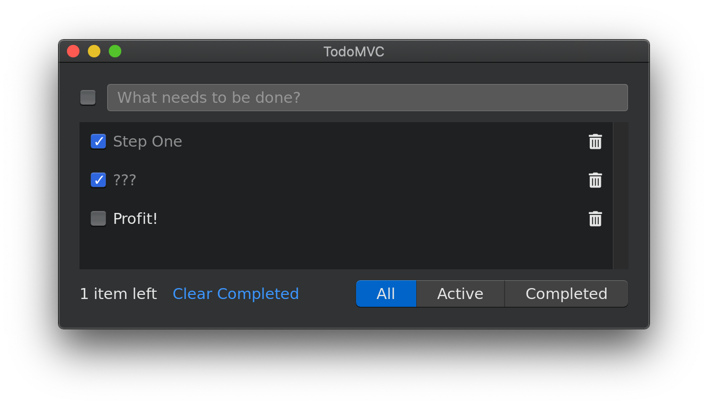
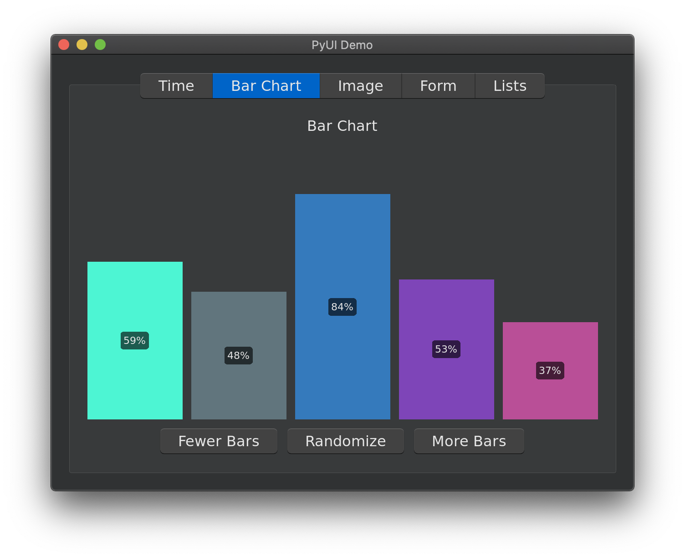
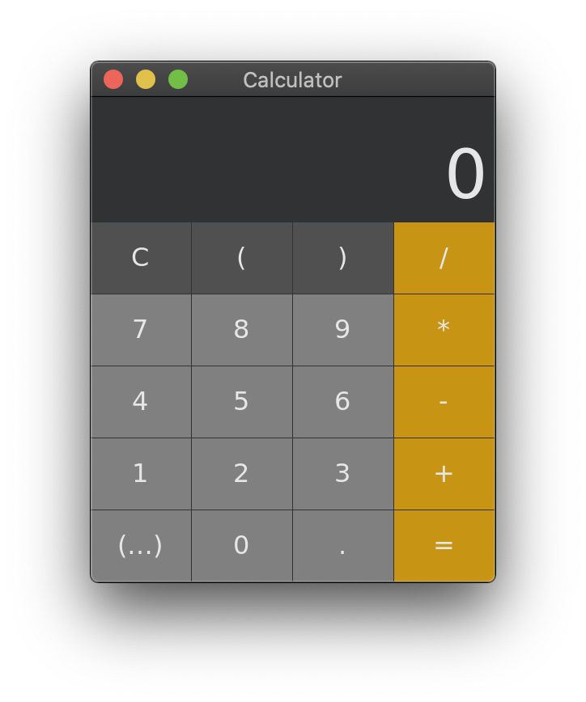
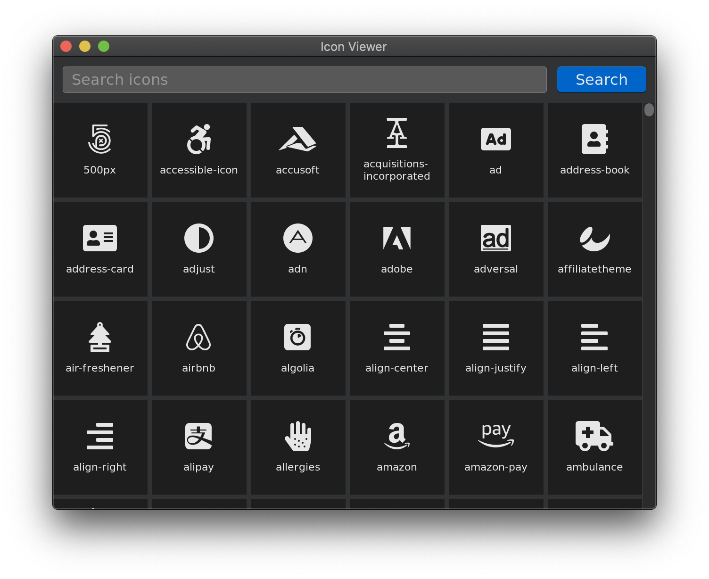

# Welcome to PyUI

PyUI is a declarative, cross-platform GUI framework modeled after SwiftUI. Using a delcarative, data-driven code style is how most modern interfaces are built. The success and intuitiveness of SwiftUI is a great example. But this style of declarative UI is still relatively new to the python ecosystem. PyUI uses the excellent [PySDL2](https://github.com/marcusva/py-sdl2) ctypes wrapper around the also excellent [SDL2](https://www.libsdl.org) library. Giving you a fast and attractive foundation for your application. PyUI aims to be a pythonic and intuitive framework for building cross-platform application UI with ease.


## Getting Started

```
pip install -r requirements.txt
python -m examples.todo
python -m examples.demo
python -m examples.calculator
python -m examples.icons
```

## Examples

See [the examples directory](examples) for code examples using PyUI. 

Example [TodoMVC](http://todomvc.com) App


Example Demo App


Example Calculator


Example Icon App
